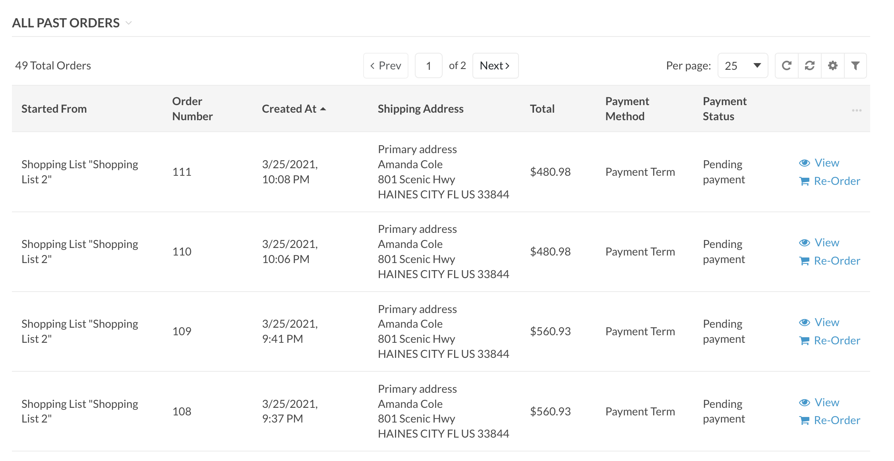

# Show Orders by Shopping List for Oro Commerce

This bundle will add shopping list information to the frontend order grid.

## Installation

    composer require phpro/oro-show-orders-by-shopping-list

## Features

The goal of this bundle is to make the link between the shopping lists and orders visible for customers in the frontend. 

Under Account > Order History you will find an overview of all orders. A column with the linked shopping list has been added to this grid. A filter for this column has also been added.

This bundle will also remove the ability to delete shopping lists. This way the link between shopping lists and orders can be preserved.
